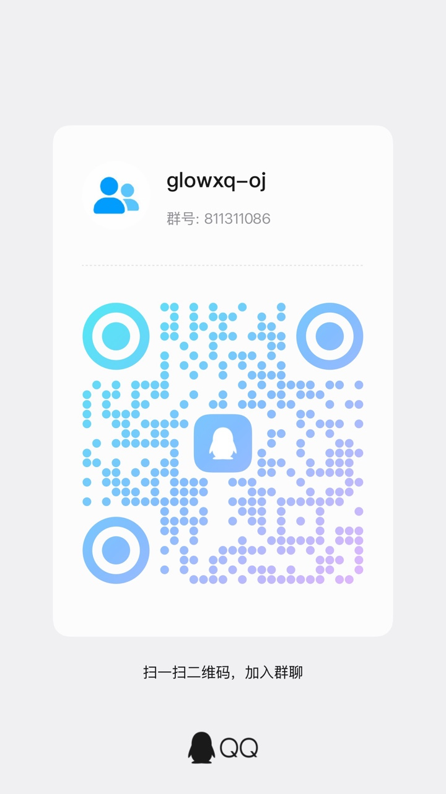

<p align="center">
  
  
  
  
  
  
</p>

# GlowXQ OJ - 在线判题系统

**GlowXQ OJ** 是一个全栈在线判题 (Online Judge) 平台，支持 C++、Java、Python、Rust、JavaScript 多语言代码提交与在线评测，内置**代码游戏**与**代码画画**两大趣味编程模块。

> GitHub: [https://github.com/glowxq/glowxq-oj](https://github.com/glowxq/glowxq-oj)

### 在线体验

- **体验地址**: [https://oj.glowxq.com](https://oj.glowxq.com)

| 角色 | 账号 | 密码 |
|------|------|------|
| 管理员 | 13667753053 | 123456 |
| 学生 | 13667753055 | 123456 |
| 老师 | 13667753056 | 123456 |

---

## 功能特性

- **多语言在线评测** — 支持 C++ / Java / Python / Rust / JavaScript，基于 go-judge 安全沙盒
- **多题型支持** — 编程题、单选题、多选题、判断题、填空题、简答题
- **代码游戏** — 关卡式编程挑战，通过编写代码控制角色移动、战斗、收集宝藏
- **代码画画** — 可视化编程环境，支持画笔绘图及数组/网格/树/链表等数据结构可视化
- **一键部署** — 提供两种 Docker 部署方案：Docker Compose（自带数据库）和 All-in-One 单容器（复用已有数据库）
- **跨架构** — 同时支持 x86_64 (amd64) 和 aarch64 (arm64 / Apple Silicon)

---

## 代码游戏 & 代码画画

除了传统 OJ 评测功能外，GlowXQ OJ 还提供两个独立的趣味编程模块，均可独立访问：

| 模块     | 在线体验                                                                           |
| -------- | ---------------------------------------------------------------------------------- |
| 代码游戏 | [coderun.glowxq.com/code-game](https://coderun.glowxq.com/code-game)              |
| 代码画画 | [coderun.glowxq.com/code-draw](https://coderun.glowxq.com/code-draw)              |

### 代码游戏 (Code Game)

> 在线体验：[coderun.glowxq.com/code-game](https://coderun.glowxq.com/code-game) &nbsp;|&nbsp; 组件：`oj-web/src/components/Oj/Games/MoveCodeGame/`

关卡式编程闯关游戏，玩家通过编写代码指令控制角色在网格地图上行动：

- **10+ 关卡**，从基础移动指令到循环、条件判断、路径规划逐步进阶
- **战斗系统** — 物理攻击（剑）与魔法攻击（法杖）对应不同怪物类型
- **地图编辑器** — 可视化拖拽设计关卡，支持 JSON 导入/导出
- **实时反馈** — 代码执行后动画展示角色移动、战斗、宝藏收集过程

### 代码画画 (Glowc)

> 在线体验：[coderun.glowxq.com/code-draw](https://coderun.glowxq.com/code-draw) &nbsp;|&nbsp; 组件：`oj-web/src/components/Oj/Glowc/`

可视化编程绘图与数据结构教学环境：

- **画笔模式 (Pen)** — 通过代码控制画笔绘制线条与形状
- **数组可视化 (Array)** — 一维数组动态展示
- **网格可视化 (Grid)** — 二维数组热力图展示
- **树可视化 (Tree)** — 二叉树/多叉树结构渲染
- **链表可视化 (List)** — 链表节点与指针动态展示
- 内置 CodeMirror 6 代码编辑器，支持代码模板与命令提示

---

## 技术栈

| 层级       | 技术                                          |
| ---------- | --------------------------------------------- |
| 后端       | Java 21 + Spring Boot 3.4 + MyBatis-Flex      |
| 前端       | Vue 3.5 + Element Plus + Vite 5 + TypeScript  |
| 代码编辑器 | CodeMirror 6                                  |
| 判题沙盒   | go-judge（支持 amd64/arm64）                   |
| 数据库     | MySQL 8.0                                     |
| 缓存       | Redis 7                                       |
| 对象存储   | MinIO                                         |
| 容器化     | Docker + Docker Compose                       |

## 项目结构

```
glowxq-oj/
├── glowxq-api/              # 后端服务（Java / Maven 多模块）
│   ├── app/app-oj/          # OJ 启动模块 + Dockerfile + go-judge
│   ├── business/            # 业务模块
│   │   ├── business-oj/     # OJ 判题业务
│   │   └── business-system/ # 系统管理业务
│   ├── common/              # 公共模块
│   └── script/              # 后端独立部署脚本 + init.sql
├── oj-web/                  # 前端 Web（Vue 3 + TypeScript）
│   └── src/
│       ├── components/Oj/Games/   # 代码游戏组件
│       └── components/Oj/Glowc/   # 代码画画组件
├── docker-compose.yml       # 全栈 Docker Compose 编排（多容器方案）
├── deploy.sh                # Docker Compose 一键部署脚本
├── Dockerfile.allinone      # All-in-One 单容器多阶段构建
├── deploy-allinone.sh       # All-in-One 部署脚本
├── supervisord.conf         # All-in-One 进程管理配置
├── nginx.allinone.conf      # All-in-One 容器内 Nginx 配置
├── entrypoint.sh            # All-in-One 容器启动入口
├── nginx.deploy.conf        # Docker Compose 方案 Nginx 配置
├── .env.example             # 环境变量模板
└── README.md                # 本文档
```

---

## 快速开始

### 环境要求

**一键部署仅需 Docker，无需安装 Java/Maven/Node！**

| 依赖              | 版本    | 用途         | 必须？           |
| ----------------- | ------- | ------------ | ---------------- |
| Docker            | >= 20   | 容器运行时   | 必须             |
| Docker Compose    | V2      | 容器编排     | 必须             |
| JDK 21            | >= 21   | 本地开发后端 | 仅本地开发需要   |
| Maven 3.6+        | >= 3.6  | 本地开发后端 | 仅本地开发需要   |
| pnpm / Node 20    | >= 20   | 本地开发前端 | 仅本地开发需要   |

> 后端 Maven 编译和前端 pnpm 构建均在 Docker 多阶段构建中自动完成，宿主机无需安装任何语言运行时。

> **两种部署方案**：如果服务器已有 MySQL/Redis，推荐使用 [All-in-One 单容器部署](#all-in-one-单容器部署)；如果想一站式全部搞定，使用下方的 Docker Compose 方案。

### Docker Compose 一键部署（自带数据库）

```bash
# 1. 克隆项目
git clone https://github.com/glowxq/glowxq-oj.git
cd glowxq-oj

# 2. 添加执行权限
chmod +x deploy.sh

# 3. 一键部署
./deploy.sh
```

部署脚本会**自动完成**以下步骤：

1. **环境检查** — Docker、Docker Compose、磁盘空间、端口冲突
2. **生成配置** — 从 `.env.example` 生成 `.env`，自动随机生成 JWT 密钥
3. **构建启动** — Docker 多阶段构建（Maven 编译 + pnpm 构建均在容器内完成），启动所有服务
4. **就绪检测** — 逐一探测 MySQL / Redis / MinIO / API / Web 服务状态

### 部署完成后

| 服务           | 地址                                |
| -------------- | ----------------------------------- |
| 前端页面       | http://localhost:80                 |
| 后端 API       | http://localhost:7101               |
| API 文档       | http://localhost:7101/doc.html      |
| MinIO 控制台   | http://localhost:9001               |

> 端口均可在 `.env` 中自定义修改，详见 [环境变量说明](#环境变量说明) 。

---

## All-in-One 单容器部署

适用于**服务器上已有 MySQL/Redis** 的场景。将前端、后端、go-judge、MinIO 打包成**单个 Docker 容器**，仅暴露一个端口，连接宿主机已有的数据库服务。

### 架构

```
宿主机 Nginx (443/SSL)
        │
        ▼
┌─── Docker 容器 (:80) ──────────────────┐
│                                         │
│   Nginx        → 前端 SPA + /api 反代   │
│   Spring Boot  → 后端 API (:7101 内部)  │
│   go-judge     → 代码沙盒 (:5050 内部)  │
│   MinIO        → 文件存储 (:9000 内部)  │
│                                         │
│   进程管理器: supervisord               │
└────────┬──────────────┬─────────────────┘
         │              │
         ▼              ▼
  宿主机 MySQL    宿主机 Redis
    (:3306)        (:6379)
```

### 快速开始

```bash
# 1. 克隆项目
git clone https://github.com/glowxq/glowxq-oj.git
cd glowxq-oj
chmod +x deploy-allinone.sh

# 2. 首次运行（自动生成 .env.allinone 配置文件）
./deploy-allinone.sh

# 3. 根据实际环境编辑配置（MySQL/Redis 地址等）
vim .env.allinone

# 4. 初始化数据库（仅首次，将 init.sql 导入宿主机 MySQL）
./deploy-allinone.sh init-db

# 5. 重启容器使配置生效
./deploy-allinone.sh restart
```

### .env.allinone 关键配置

```bash
# ─── 站点配置 ──────────────────────────
# 站点公网地址（生产环境必填，决定文件 URL 的域名）
# 本地测试可不设置
SITE_URL=https://oj.example.com

# 宿主机端口映射（容器 80 → 宿主机端口，默认 80）
WEB_PORT=80

# ─── MySQL（宿主机已有）─────────────────
MYSQL_HOST=host.docker.internal
MYSQL_PORT=3306
MYSQL_DATABASE=glowxq_oj
MYSQL_ROOT_PASSWORD=your_password

# ─── Redis（宿主机已有）─────────────────
REDIS_HOST=host.docker.internal
REDIS_PORT=6379
REDIS_PASSWORD=your_password
```

> **`SITE_URL` 的作用**：后端会生成文件访问 URL（如头像、题目附件），该 URL 需要浏览器能访问到。`SITE_URL` 决定了这些 URL 的域名前缀。文件实际通过容器内 Nginx 代理到 MinIO。

### 端口映射示例

如果宿主机 80 端口已被占用，可映射到其他端口：

```bash
# .env.allinone
WEB_PORT=7101
SITE_URL=https://oj.example.com
```

此时的请求链路：

```
浏览器 → 宿主机 Nginx (443/SSL) → 容器 (7101→80) → 内部服务
```

宿主机 Nginx 配置示例：

```nginx
server {
    listen 443 ssl;
    server_name oj.example.com;

    ssl_certificate     /path/to/cert.pem;
    ssl_certificate_key /path/to/cert.key;

    location / {
        proxy_pass http://127.0.0.1:7101;
        proxy_set_header Host $host;
        proxy_set_header X-Real-IP $remote_addr;
        proxy_set_header X-Forwarded-For $proxy_add_x_forwarded_for;
        proxy_set_header X-Forwarded-Proto $scheme;

        # WebSocket 支持
        proxy_http_version 1.1;
        proxy_set_header Upgrade $http_upgrade;
        proxy_set_header Connection "upgrade";

        proxy_read_timeout 120s;
        client_max_body_size 50m;
    }
}
```

### 部署脚本命令

```bash
./deploy-allinone.sh              # 构建镜像 + 启动容器（默认）
./deploy-allinone.sh stop         # 停止容器
./deploy-allinone.sh restart      # 重启容器
./deploy-allinone.sh update       # 重新构建并部署（代码更新后使用）
./deploy-allinone.sh logs         # 查看容器日志
./deploy-allinone.sh status       # 查看容器状态
./deploy-allinone.sh shell        # 进入容器 Shell
./deploy-allinone.sh init-db      # 首次导入数据库
./deploy-allinone.sh help         # 显示帮助
```

### 数据持久化

通过 Docker Volume 持久化，容器删除/重建后数据不丢失：

| Volume     | 容器路径       | 说明                     |
| ---------- | -------------- | ------------------------ |
| `oj-data`  | `/data`        | MinIO 文件存储           |
| `oj-judge` | `/goj`         | 测试用例、上传文件等     |

### 等效 docker run

如果不使用部署脚本，可以直接运行：

```bash
docker build -f Dockerfile.allinone -t glowxq-oj:allinone .

docker run -d --name glowxq-oj \
  --privileged \
  --restart unless-stopped \
  -p 80:80 \
  -v oj-data:/data \
  -v oj-judge:/goj \
  -e MYSQL_HOST=host.docker.internal \
  -e MYSQL_PORT=3306 \
  -e MYSQL_DATABASE=glowxq_oj \
  -e MYSQL_ROOT_PASSWORD=xxx \
  -e REDIS_HOST=host.docker.internal \
  -e REDIS_PORT=6379 \
  -e REDIS_PASSWORD=xxx \
  -e SITE_URL=https://oj.example.com \
  -e JWT_SECRET_KEY=xxx \
  glowxq-oj:allinone
```

> Linux 服务器需要额外添加 `--add-host=host.docker.internal:host-gateway` 才能访问宿主机服务（macOS Docker Desktop 自带支持）。

---

## Docker Compose 部署脚本命令

```bash
# ─── 部署命令 ───────────────────────────────
./deploy.sh              # 一键全栈部署（默认）
./deploy.sh deploy       # 同上
./deploy.sh start        # 启动服务（不重新构建镜像）
./deploy.sh stop         # 停止所有服务
./deploy.sh restart      # 重启所有服务
./deploy.sh update       # 重新编译 + 构建 + 部署（代码更新后使用）

# ─── 开发命令 ───────────────────────────────
./deploy.sh dev          # 仅启动基础设施（MySQL + Redis + MinIO）
./deploy.sh dev-stop     # 停止基础设施
./deploy.sh build-api    # 仅构建后端镜像（Docker 内编译）
./deploy.sh build-web    # 仅构建前端镜像

# ─── 运维命令 ───────────────────────────────
./deploy.sh status       # 查看容器状态
./deploy.sh health       # 服务健康状态面板 + 资源使用
./deploy.sh logs         # 查看所有服务日志
./deploy.sh logs oj-api  # 查看后端日志
./deploy.sh logs oj-web  # 查看前端日志
./deploy.sh backup       # 备份数据（MySQL dump + 数据目录打包）
./deploy.sh prune        # 清理无用 Docker 镜像和缓存

# ─── 危险命令（需二次确认）───────────────────
./deploy.sh clean        # 停止并清理所有容器和数据
./deploy.sh reset-db     # 重置数据库（重新执行 init.sql）

# ─── 其他 ───────────────────────────────────
./deploy.sh version      # 显示版本
./deploy.sh help         # 显示帮助
```

---

## 服务架构（Docker Compose 方案）

```
                     ┌──────────────┐
                     │   Browser    │
                     └──────┬───────┘
                            │
                     ┌──────▼───────┐
                     │  Nginx (:80) │  ← 前端 SPA + /api 反向代理
                     └──────┬───────┘
                            │ /api/*
                     ┌──────▼───────────────┐
                     │  OJ API (:7101)      │  ← Spring Boot
                     │  + go-judge (:5050)  │  ← 代码沙盒
                     └──┬────┬────┬─────────┘
                        │    │    │
           ┌────────────┘    │    └───────────┐
           ▼                 ▼                ▼
    ┌────────────┐   ┌────────────┐   ┌────────────┐
    │ MySQL      │   │ Redis      │   │ MinIO      │
    │ (:3306)    │   │ (:6379)    │   │ (:9000)    │
    └────────────┘   └────────────┘   └────────────┘
```

> All-in-One 单容器方案的架构图见 [All-in-One 单容器部署](#all-in-one-单容器部署) 章节。

### 服务说明

| 服务       | 容器名       | 端口           | 说明                           |
| ---------- | ------------ | -------------- | ------------------------------ |
| MySQL      | oj-mysql     | 3306           | 主数据库，存储用户/题目/提交等   |
| Redis      | oj-redis     | 6379           | 缓存 + 会话 + 排行榜            |
| MinIO      | oj-minio     | 9000 / 9001    | 文件存储（题目附件、头像等）     |
| OJ API     | oj-api       | 7101 / 5050    | 后端服务 + 判题沙盒              |
| OJ Web     | oj-web       | 80             | 前端 Nginx 托管                  |

### 支持的编程语言

| 语言       | 编译 / 运行时        |
| ---------- | -------------------- |
| C++        | g++ (GCC)            |
| Java       | JDK 21               |
| Python     | Python 3             |
| Rust       | rustc                |
| JavaScript | Node.js              |

---

## 开发指南

### 开发模式

开发时无需全量 Docker 部署，只需启动基础设施即可：

```bash
# 1. 启动 MySQL + Redis + MinIO
./deploy.sh dev

# 2. 后端：IDE 中运行 或命令行启动
cd glowxq-api
mvn spring-boot:run -pl app/app-oj

# 3. 前端：安装依赖并启动开发服务器
cd oj-web
pnpm install
pnpm dev        # 默认端口 9848，自动代理 /api 到后端

# 4. 开发结束后停止基础设施
./deploy.sh dev-stop
```

### 后端开发

```bash
cd glowxq-api

# 编译
mvn clean package -DskipTests

# 运行（需先启动基础设施）
mvn spring-boot:run -pl app/app-oj

# 代码格式化
mvn spotless:apply
```

**Maven 模块结构：**

| 模块                    | 职责                 |
| ----------------------- | -------------------- |
| `app/app-oj`            | 应用启动入口 + 判题沙盒 |
| `business/business-oj`  | OJ 判题业务逻辑       |
| `business/business-system` | 系统管理业务逻辑    |
| `common`                | 公共工具类和模型      |
| `dependencies`          | 依赖版本管理          |

### 前端开发

```bash
cd oj-web

# 安装依赖（推荐 pnpm）
pnpm install

# 启动开发服务器
pnpm dev              # OJ 模式

# 构建生产包
pnpm build-only --mode oj

# 代码检查 & 格式化
pnpm lint
pnpm format
```

**前端环境配置文件：**

| 文件路径                 | 用途               |
| ------------------------ | ------------------ |
| `oj-web/env/.env`        | 通用配置（端口等） |
| `oj-web/env/.env.oj`     | 生产环境 API 地址  |
| `oj-web/env/dev/.env.oj` | 开发环境 API 地址  |

> 开发模式下，Vite 会自动将 `/api` 请求代理到后端地址（默认 `http://127.0.0.1:7101/api`）。

---

## 环境变量说明

所有配置均在项目根目录 `.env` 文件中管理（首次部署时自动从 `.env.example` 生成）：

```bash
# ─── MySQL ─────────────────────────────
MYSQL_ROOT_PASSWORD=glowxq123456   # 数据库 root 密码
MYSQL_DATABASE=glowxq_oj           # 数据库名
MYSQL_PORT=3306                    # 对外端口

# ─── Redis ─────────────────────────────
REDIS_PASSWORD=glowxq123456        # Redis 密码
REDIS_PORT=6379                    # 对外端口
REDIS_DATABASE=1                   # 使用的 DB 编号

# ─── MinIO ─────────────────────────────
MINIO_ACCESS_KEY=minioadmin        # 访问密钥
MINIO_SECRET_KEY=minioadmin        # 密钥
MINIO_BUCKET=nexus-oj              # 默认 Bucket
MINIO_API_PORT=9000                # API 端口
MINIO_CONSOLE_PORT=9001            # 管理控制台端口

# ─── JWT ───────────────────────────────
JWT_SECRET_KEY=xxx                 # 部署脚本自动生成随机密钥

# ─── 后端 ──────────────────────────────
APP_PORT=7101                      # API 对外端口
SANDBOX_PORT=5050                  # go-judge 沙盒端口
JAVA_OPTS=-Xms256m -Xmx512m       # JVM 参数

# ─── 前端 ──────────────────────────────
WEB_PORT=80                        # 前端对外端口

# ─── 数据 ──────────────────────────────
DATA_DIR=./data                    # 持久化数据目录

# ─── 飞书集成（可选）───────────────────
# FEISHU_INTERNAL_WEBHOOK=
# FEISHU_BUSINESS_WEBHOOK=
# FEISHU_APP_ID=
# FEISHU_APP_SECRET=
```

---

## 手动部署

如果不想使用一键脚本，可按以下步骤手动操作（仅需 Docker）：

```bash
# 1. 克隆项目
git clone https://github.com/glowxq/glowxq-oj.git
cd glowxq-oj

# 2. 配置环境变量
cp .env.example .env
# 编辑 .env 修改密码和配置（至少修改 JWT_SECRET_KEY）

# 3. 构建并启动所有服务（Maven/pnpm 编译在 Docker 内自动完成）
DOCKER_BUILDKIT=1 docker compose up -d --build

# 4. 查看日志
docker compose logs -f

# 5. 停止服务
docker compose down
```

---

## 常见问题

<details>
<summary><b>Q: 端口冲突怎么办？</b></summary>

修改 `.env` 文件中对应的端口配置：

```bash
MYSQL_PORT=3307           # MySQL
REDIS_PORT=6380           # Redis
APP_PORT=7102             # 后端 API
WEB_PORT=8080             # 前端
MINIO_API_PORT=9002       # MinIO API
MINIO_CONSOLE_PORT=9003   # MinIO 控制台
```
</details>

<details>
<summary><b>Q: 后端日志如何查看？</b></summary>

```bash
./deploy.sh logs oj-api
# 或
docker logs -f oj-api
```
</details>

<details>
<summary><b>Q: 如何重置数据库？</b></summary>

```bash
./deploy.sh reset-db
# 会停止 MySQL 容器，删除数据后重启，自动执行 init.sql 初始化
```
</details>

<details>
<summary><b>Q: Docker 构建很慢怎么办？</b></summary>

配置 Docker 镜像加速器，编辑 Docker Desktop 设置或 `/etc/docker/daemon.json`：

```json
{
  "registry-mirrors": ["https://mirror.ccs.tencentyun.com"]
}
```
</details>

<details>
<summary><b>Q: 如何备份数据？</b></summary>

```bash
./deploy.sh backup
# 会自动导出 MySQL 数据库 + 打包整个数据目录
# 备份文件保存在 ./backups/ 目录下
```
</details>

<details>
<summary><b>Q: 如何只更新后端/前端代码？</b></summary>

```bash
# 更新后端
./deploy.sh build-api
docker compose up -d oj-api

# 更新前端
docker compose up -d --build oj-web

# 或使用 update 命令重建全部（推荐）
./deploy.sh update
```
</details>

<details>
<summary><b>Q: 应该选择 Docker Compose 方案还是 All-in-One 方案？</b></summary>

| 场景 | 推荐方案 | 原因 |
|------|----------|------|
| 首次体验 / 本地开发 | Docker Compose (`deploy.sh`) | 自带 MySQL/Redis，开箱即用 |
| 服务器已有 MySQL/Redis | All-in-One (`deploy-allinone.sh`) | 单容器、单端口，管理简单 |
| 需要独立扩展数据库 | Docker Compose | 各服务独立容器，灵活扩展 |
| 多项目共享基础设施 | All-in-One | 复用已有数据库，不重复启动 |

</details>

<details>
<summary><b>Q: All-in-One 方案中 API 返回 404 怎么排查？</b></summary>

通常是 Spring Boot 连不上 MySQL/Redis 导致应用崩溃重启：

```bash
# 1. 查看容器日志
./deploy-allinone.sh logs

# 2. 常见原因
# - MySQL/Redis 未启动：检查宿主机服务是否运行
# - 连接地址错误：检查 .env 中 MYSQL_HOST / REDIS_HOST
# - Linux 上 host.docker.internal 不通：脚本已自动添加 --add-host，如手动 docker run 需自行添加
# - 密码不对：检查 .env 中密码与实际数据库密码是否一致
```

</details>

<details>
<summary><b>Q: All-in-One 方案中上传的文件/头像无法显示？</b></summary>

文件存储在容器内 MinIO 中，通过 Nginx 代理 `/nexus-oj/` 路径访问。如果文件 URL 无法访问：

1. 检查是否设置了 `SITE_URL`（生产环境必须设置为公网域名）
2. 确认宿主机 Nginx 正确代理到容器端口
3. 本地测试时访问 `http://localhost/nexus-oj/` 应返回 200

</details>

<details>
<summary><b>Q: 判题沙盒 go-judge 在哪里？</b></summary>

go-judge 集成在后端 Docker 镜像中（`app/app-oj/Sandbox-amd64` 和 `Sandbox-arm64`），启动时会自动检测 CPU 架构并选择对应版本。沙盒端口默认为 5050。
</details>

<details>
<summary><b>Q: 内存不足怎么调整？</b></summary>

修改 `.env` 中的 JVM 参数：

```bash
# 小内存环境（2GB 总内存）
JAVA_OPTS=-Xms128m -Xmx256m

# 标准环境（4GB+）
JAVA_OPTS=-Xms256m -Xmx512m

# 大内存环境（8GB+）
JAVA_OPTS=-Xms512m -Xmx1024m
```
</details>

---

## 联系方式 & 技术服务

如果您有**软件开发需求**（Web 应用、小程序、系统定制等），欢迎联系：

| 渠道       | 详情                                                              |
| ---------- | ----------------------------------------------------------------- |
| 接单平台   | [case.glowxq.com](https://case.glowxq.com)                       |
| 邮箱       | [glowxq@qq.com](mailto:glowxq@qq.com)                            |
| 电话/微信  | 19323030408                                                       |

> 提供全栈开发、系统架构设计、技术咨询等服务，欢迎洽谈合作。

### 交流群

欢迎加入交流群，一起讨论技术、反馈问题：

<p>
  
  &nbsp;&nbsp;&nbsp;&nbsp;
  
</p>

### 打赏支持

如果本项目对你有帮助，欢迎打赏支持，你的鼓励是持续开源的动力：

<p>
  
</p>

---

## License

本项目采用 [Apache License 2.0](https://www.apache.org/licenses/LICENSE-2.0) 开源许可证。

```
Copyright 2025 GlowXQ

Licensed under the Apache License, Version 2.0 (the "License");
you may not use this file except in compliance with the License.
You may obtain a copy of the License at

    http://www.apache.org/licenses/LICENSE-2.0

Unless required by applicable law or agreed to in writing, software
distributed under the License is distributed on an "AS IS" BASIS,
WITHOUT WARRANTIES OR CONDITIONS OF ANY KIND, either express or implied.
See the License for the specific language governing permissions and
limitations under the License.
```
