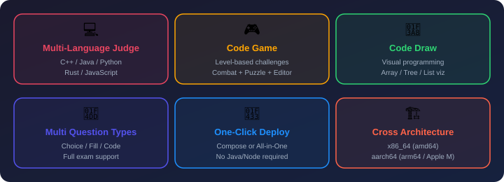
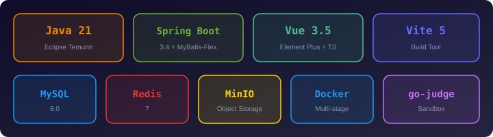
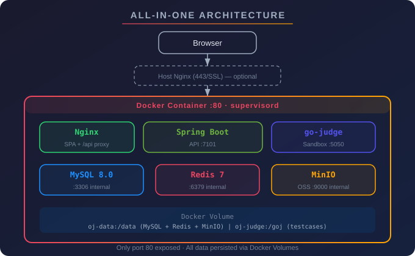
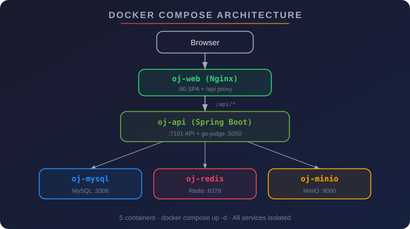

<div align="center">


<br/>
<br/>

<h3>全栈在线判题系统 | Online Judge Platform</h3>

<p>
  支持 C++ / Java / Python / Rust / JavaScript 多语言评测<br/>
  内置代码游戏与代码画画两大趣味编程模块
</p>

<br/>

<p>
  
  
  
  
  
  
</p>

<p>
  <a href="https://oj.glowxq.com"><strong>🌐 在线体验</strong></a>
  &nbsp;&middot;&nbsp;
  <a href="#-快速开始"><strong>🚀 快速开始</strong></a>
  &nbsp;&middot;&nbsp;
  <a href="#-功能特性"><strong>✨ 功能特性</strong></a>
  &nbsp;&middot;&nbsp;
  <a href="https://github.com/glowxq/glowxq-oj"><strong>GitHub</strong></a>
  &nbsp;&middot;&nbsp;
  <a href="https://gitee.com/glowxq/glowxq-oj"><strong>Gitee</strong></a>
</p>

<br/>

> 📢 **国内用户**：如果 GitHub 访问较慢，可使用 Gitee 镜像仓库克隆项目
>
> `git clone https://gitee.com/glowxq/glowxq-oj.git`

</div>

<br/>


<br/>

## 在线体验

|  | 地址 | 账号 | 密码 |
|---|---|---|---|
| 👨‍💼 管理员 | [oj.glowxq.com](https://oj.glowxq.com) | 13667753053 | 123456 |
| 🎓 学生 | [oj.glowxq.com](https://oj.glowxq.com) | 13667753055 | 123456 |
| 👩‍🏫 老师 | [oj.glowxq.com](https://oj.glowxq.com) | 13667753056 | 123456 |

<br/>

## 📑 目录

- [功能特性](#-功能特性)
- [代码游戏 & 代码画画](#-代码游戏--代码画画)
- [技术栈](#-技术栈)
- [快速开始](#-快速开始)
  - [Docker Compose 部署](#-docker-compose-一键部署自带数据库)
  - [All-in-One 单容器部署](#-all-in-one-单容器部署全家桶)
- [服务架构](#-服务架构)
- [开发指南](#-开发指南)
- [项目结构](#-项目结构)
- [环境变量说明](#-环境变量说明)
- [常见问题](#-常见问题)
- [联系方式](#-联系方式--技术服务)
- [License](#-license)

<br/>


<br/>

## ✨ 功能特性

<div align="center">
  
</div>

<br/>

<table>
  <tr>
    <td width="50%">

**💻 多语言在线评测**
支持 C++ / Java / Python / Rust / JavaScript，基于 go-judge 安全沙盒，同时支持 x86_64 与 arm64 架构

</td>
    <td width="50%">

**📝 多题型支持**
编程题、单选题、多选题、判断题、填空题、简答题，满足多样化教学与考核需求

</td>
  </tr>
  <tr>
    <td>

**🎮 代码游戏**
关卡式编程挑战，通过编写代码控制角色移动、战斗、收集宝藏，寓教于乐

</td>
    <td>

**🎨 代码画画**
可视化编程环境，支持画笔绘图及数组/网格/树/链表等数据结构动态可视化

</td>
  </tr>
  <tr>
    <td>

**🐳 一键 Docker 部署**
两种方案可选：Docker Compose（多容器）和 All-in-One 单容器全家桶，无需宿主机安装 Java/Maven/Node

</td>
    <td>

**🏗 跨架构支持**
同时兼容 x86_64 (amd64) 和 aarch64 (arm64 / Apple Silicon)，Docker 构建自动适配

</td>
  </tr>
</table>

<br/>


<br/>

## 🎮 代码游戏 & 代码画画

除了传统 OJ 评测，GlowXQ OJ 还提供两个独立的趣味编程模块，可单独访问：

### 🕹 代码游戏 (Code Game)

> 在线体验：[coderun.glowxq.com/code-game](https://coderun.glowxq.com/code-game)&ensp;|&ensp;组件：`oj-web/src/components/Oj/Games/MoveCodeGame/`

关卡式编程闯关游戏，玩家通过编写代码指令控制角色在网格地图上行动：

- **10+ 关卡** — 从基础移动指令到循环、条件判断、路径规划逐步进阶
- **战斗系统** — 物理攻击（剑）与魔法攻击（法杖）对应不同怪物类型
- **地图编辑器** — 可视化拖拽设计关卡，支持 JSON 导入/导出
- **实时反馈** — 代码执行后动画展示角色移动、战斗、宝藏收集过程

### 🖌 代码画画 (Glowc)

> 在线体验：[coderun.glowxq.com/code-draw](https://coderun.glowxq.com/code-draw)&ensp;|&ensp;组件：`oj-web/src/components/Oj/Glowc/`

可视化编程绘图与数据结构教学环境：

- **画笔模式 (Pen)** — 通过代码控制画笔绘制线条与形状
- **数组可视化 (Array)** — 一维数组动态展示
- **网格可视化 (Grid)** — 二维数组热力图展示
- **树可视化 (Tree)** — 二叉树/多叉树结构渲染
- **链表可视化 (List)** — 链表节点与指针动态展示
- 内置 CodeMirror 6 代码编辑器，支持代码模板与命令提示

<br/>


<br/>

## 🛠 技术栈

<div align="center">
  
</div>

<br/>

| 层级 | 技术 |
|---|---|
| **后端** | Java 21 + Spring Boot 3.4 + MyBatis-Flex |
| **前端** | Vue 3.5 + Element Plus + Vite 5 + TypeScript |
| **代码编辑器** | CodeMirror 6 |
| **判题沙盒** | go-judge（支持 amd64 / arm64） |
| **数据库** | MySQL 8.0 |
| **缓存** | Redis 7 |
| **对象存储** | MinIO |
| **容器化** | Docker + Docker Compose |

### 支持的编程语言

| 语言 | 编译 / 运行时 |
|---|---|
| C++ | g++ (GCC) |
| Java | JDK 21 |
| Python | Python 3 |
| Rust | rustc |
| JavaScript | Node.js |

<br/>


<br/>

## 🚀 快速开始

### 环境要求

> **一键部署仅需 Docker，无需安装 Java / Maven / Node！**
> 后端 Maven 编译和前端 pnpm 构建均在 Docker 多阶段构建中自动完成。

| 依赖 | 版本 | 必须？ |
|---|---|---|
| Docker | >= 20 | **必须** |
| Docker Compose | V2 | **必须** |
| JDK 21 / Maven 3.6+ | >= 21 | 仅本地开发 |
| pnpm / Node 20 | >= 20 | 仅本地开发 |

> **两种部署方案对比**：
>
> | 方案 | 适用场景 | 容器数 | 是否自带数据库 |
> |---|---|---|---|
> | [Docker Compose](#-docker-compose-一键部署自带数据库) | 本地开发 / 首次体验 / 需要独立管理各服务 | 5 个 | ✅ 独立 MySQL + Redis 容器 |
> | [All-in-One 全家桶](#-all-in-one-单容器部署全家桶) | 生产部署 / 一台服务器 / 追求极简 | 1 个 | ✅ 内置 MySQL + Redis |

<br/>


<br/>

### 🐳 Docker Compose 一键部署（自带数据库）

```bash
# 1. 克隆项目（GitHub 或 Gitee 二选一）
git clone https://github.com/glowxq/glowxq-oj.git
# git clone https://gitee.com/glowxq/glowxq-oj.git    # 国内镜像

cd glowxq-oj

# 2. 一键部署（自动检查环境 → 生成配置 → 构建 → 启动）
chmod +x deploy.sh
./deploy.sh
```

部署完成后自动可用：

| 服务 | 地址 |
|---|---|
| 前端页面 | http://localhost |
| 后端 API | http://localhost:7101 |
| API 文档 | http://localhost:7101/doc.html |
| MinIO 控制台 | http://localhost:9001 |

> 端口可在 `.env` 中自定义，详见 [环境变量说明](#-环境变量说明)

<details>
<summary><b>📋 Docker Compose 脚本命令一览</b></summary>

```bash
# ─── 部署 ─────────────────────────────────
./deploy.sh              # 一键全栈部署（默认）
./deploy.sh start        # 启动（不重新构建）
./deploy.sh stop         # 停止所有服务
./deploy.sh restart      # 重启所有服务
./deploy.sh update       # 重新编译 + 构建 + 部署

# ─── 开发 ─────────────────────────────────
./deploy.sh dev          # 仅启动 MySQL + Redis + MinIO
./deploy.sh dev-stop     # 停止基础设施
./deploy.sh build-api    # 仅构建后端镜像
./deploy.sh build-web    # 仅构建前端镜像

# ─── 运维 ─────────────────────────────────
./deploy.sh status       # 容器状态
./deploy.sh health       # 健康面板 + 资源使用
./deploy.sh logs oj-api  # 查看后端日志
./deploy.sh backup       # 备份数据
./deploy.sh prune        # 清理无用镜像

# ─── 危险（需确认）────────────────────────
./deploy.sh clean        # 清理所有容器和数据
./deploy.sh reset-db     # 重置数据库
```

</details>

<br/>


<br/>

### 📦 All-in-One 单容器部署（全家桶）

**6 个服务打包成 1 个 Docker 容器**，内置 MySQL + Redis + Nginx + Spring Boot + go-judge + MinIO，仅暴露 80 端口，数据持久化到 Docker Volume。零依赖，开箱即用。

<div align="center">
  
</div>

<br/>

#### 快速开始

```bash
# 1. 克隆项目（GitHub 或 Gitee 二选一）
git clone https://github.com/glowxq/glowxq-oj.git
# git clone https://gitee.com/glowxq/glowxq-oj.git    # 国内镜像

cd glowxq-oj
chmod +x deploy-allinone.sh

# 2. 一键部署（自动生成配置 → 构建 → 启动 → 初始化数据库）
./deploy-allinone.sh

# 3. （可选）编辑配置后重启
vim .env.allinone       # 修改站点 URL、密码等
./deploy-allinone.sh restart
```

#### 关键配置 (.env.allinone)

```bash
# ─── 站点配置 ────────────────────────────
SITE_URL=https://oj.example.com   # 生产环境必填，决定文件 URL 域名
WEB_PORT=80                       # 容器 80 → 宿主机端口

# ─── 内置数据库密码 ─────────────────────
MYSQL_ROOT_PASSWORD=glowxq123456  # 容器内 MySQL root 密码
MYSQL_DATABASE=glowxq_oj          # 数据库名
REDIS_PASSWORD=glowxq123456       # 容器内 Redis 密码
```

> **全自动初始化**：首次启动时自动创建数据库、导入表结构、初始化 MinIO。无需手动操作。

<details>
<summary><b>🌐 宿主机 Nginx SSL 反代配置示例</b></summary>

当 `WEB_PORT=80` 时，宿主机 Nginx 配置：

```nginx
server {
    listen 443 ssl;
    server_name oj.example.com;

    ssl_certificate     /path/to/cert.pem;
    ssl_certificate_key /path/to/cert.key;

    location / {
        proxy_pass http://127.0.0.1:80;
        proxy_set_header Host $host;
        proxy_set_header X-Real-IP $remote_addr;
        proxy_set_header X-Forwarded-For $proxy_add_x_forwarded_for;
        proxy_set_header X-Forwarded-Proto $scheme;

        # WebSocket 支持
        proxy_http_version 1.1;
        proxy_set_header Upgrade $http_upgrade;
        proxy_set_header Connection "upgrade";

        proxy_read_timeout 120s;
        client_max_body_size 50m;
    }
}
```

</details>

<details>
<summary><b>📋 All-in-One 脚本命令一览</b></summary>

```bash
./deploy-allinone.sh              # 构建 + 启动（默认）
./deploy-allinone.sh stop         # 停止容器
./deploy-allinone.sh restart      # 重启容器
./deploy-allinone.sh update       # 重新构建部署
./deploy-allinone.sh logs         # 查看日志
./deploy-allinone.sh status       # 查看状态
./deploy-allinone.sh shell        # 进入容器 Shell
./deploy-allinone.sh reset-db     # 重置数据库（删除所有数据）
```

</details>

<details>
<summary><b>🐳 等效 docker run 命令</b></summary>

```bash
docker build -f Dockerfile.allinone -t glowxq-oj:allinone .

docker run -d --name glowxq-oj \
  --privileged --restart unless-stopped \
  -p 80:80 \
  -v oj-data:/data \
  -v oj-judge:/goj \
  -e MYSQL_ROOT_PASSWORD=glowxq123456 \
  -e MYSQL_DATABASE=glowxq_oj \
  -e REDIS_PASSWORD=glowxq123456 \
  -e SITE_URL=https://oj.example.com \
  -e JWT_SECRET_KEY=your_jwt_secret \
  glowxq-oj:allinone
```

</details>

<details>
<summary><b>💾 数据持久化</b></summary>

通过 Docker Volume 持久化，容器重建后数据不丢失：

| Volume | 容器路径 | 说明 |
|---|---|---|
| `oj-data` | `/data` | MySQL 数据 + Redis 数据 + MinIO 文件 |
| `oj-judge` | `/goj` | 测试用例、上传文件等 |

> 如需完全重置数据：`./deploy-allinone.sh reset-db`

</details>

<br/>


<br/>

## 🏗 服务架构

### Docker Compose 方案

<div align="center">
  
</div>

<br/>

| 服务 | 容器名 | 端口 | 说明 |
|---|---|---|---|
| MySQL | oj-mysql | 3306 | 主数据库，用户/题目/提交 |
| Redis | oj-redis | 6379 | 缓存 + 会话 + 排行榜 |
| MinIO | oj-minio | 9000 / 9001 | 文件存储（附件、头像等） |
| OJ API | oj-api | 7101 / 5050 | 后端 + 判题沙盒 |
| OJ Web | oj-web | 80 | 前端 Nginx 托管 |

### All-in-One 方案

单容器内通过 **supervisord** 管理 6 个进程，仅暴露 80 端口：

| 进程 | 内部端口 | 说明 |
|---|---|---|
| MySQL | 3306 | 内置数据库 |
| Redis | 6379 | 内置缓存 |
| Nginx | 80 | 前端 SPA + /api 反代 |
| Spring Boot | 7101 | 后端 API |
| go-judge | 5050 | 代码沙盒 |
| MinIO | 9000 | 文件存储 |

<br/>


<br/>

## 💻 开发指南

### 开发模式

开发时无需全量部署，只需启动基础设施：

```bash
# 1. 启动 MySQL + Redis + MinIO
./deploy.sh dev

# 2. 后端
cd glowxq-api
mvn spring-boot:run -pl app/app-oj

# 3. 前端
cd oj-web
pnpm install
pnpm dev        # 默认端口 9848，自动代理 /api 到后端

# 4. 开发结束
./deploy.sh dev-stop
```

### 后端开发

```bash
cd glowxq-api
mvn clean package -DskipTests    # 编译
mvn spring-boot:run -pl app/app-oj   # 运行
mvn spotless:apply               # 格式化
```

**Maven 模块结构：**

| 模块 | 职责 |
|---|---|
| `app/app-oj` | 应用启动入口 + 判题沙盒 |
| `business/business-oj` | OJ 判题业务逻辑 |
| `business/business-system` | 系统管理业务逻辑 |
| `common` | 公共工具类和模型 |
| `dependencies` | 依赖版本管理 |

### 前端开发

```bash
cd oj-web
pnpm install              # 安装依赖
pnpm dev                  # OJ 开发服务器
pnpm build-only --mode oj # 构建生产包
pnpm lint                 # 代码检查
pnpm format               # 格式化
```

**环境配置文件：**

| 文件 | 用途 |
|---|---|
| `oj-web/env/.env` | 通用配置（端口等） |
| `oj-web/env/.env.oj` | 生产环境 API 地址 |
| `oj-web/env/dev/.env.oj` | 开发环境 API 地址 |

> 开发模式下 Vite 自动将 `/api` 请求代理到后端（默认 `http://127.0.0.1:7101/api`）。

<br/>


<br/>

## 📁 项目结构

```
glowxq-oj/
├── glowxq-api/                # 后端（Java / Maven 多模块）
│   ├── app/app-oj/            #   启动模块 + Dockerfile + go-judge
│   ├── business/              #   业务模块
│   │   ├── business-oj/       #     OJ 判题
│   │   └── business-system/   #     系统管理
│   ├── common/                #   公共模块
│   └── script/                #   init.sql + 独立部署脚本
│
├── oj-web/                    # 前端（Vue 3 + TypeScript）
│   └── src/
│       ├── components/Oj/Games/   # 代码游戏
│       └── components/Oj/Glowc/   # 代码画画
│
├── docs/                      # 文档资源
│   ├── svg/                   #   架构图 & 装饰性 SVG
│   └── img/                   #   二维码等图片
│
├── docker-compose.yml         # Docker Compose 编排
├── deploy.sh                  # Compose 部署脚本
├── Dockerfile.allinone        # All-in-One 多阶段构建
├── deploy-allinone.sh         # All-in-One 部署脚本
├── supervisord.conf           # All-in-One 进程管理
├── nginx.allinone.conf        # All-in-One Nginx 配置
├── entrypoint.sh              # All-in-One 启动入口
├── nginx.deploy.conf          # Compose Nginx 配置
├── .env.example               # 环境变量模板
└── README.md
```

<br/>


<br/>

## ⚙ 环境变量说明

所有配置在 `.env` 文件中管理（首次部署自动从 `.env.example` 生成）：

```bash
# ─── 站点 ─────────────────────────────
SITE_URL=                          # 站点公网地址（生产部署时设置）

# ─── MySQL ────────────────────────────
MYSQL_ROOT_PASSWORD=glowxq123456   # root 密码
MYSQL_DATABASE=glowxq_oj           # 数据库名
MYSQL_PORT=3306                    # 对外端口

# ─── Redis ────────────────────────────
REDIS_PASSWORD=glowxq123456        # 密码
REDIS_PORT=6379                    # 对外端口
REDIS_DATABASE=1                   # DB 编号

# ─── MinIO ────────────────────────────
MINIO_ACCESS_KEY=minioadmin        # 访问密钥
MINIO_SECRET_KEY=minioadmin        # 密钥
MINIO_BUCKET=nexus-oj              # 默认 Bucket
MINIO_API_PORT=9000                # API 端口
MINIO_CONSOLE_PORT=9001            # 控制台端口

# ─── JWT ──────────────────────────────
JWT_SECRET_KEY=xxx                 # 部署脚本自动生成

# ─── 后端 ─────────────────────────────
APP_PORT=7101                      # API 端口
SANDBOX_PORT=5050                  # go-judge 端口
JAVA_OPTS=-Xms256m -Xmx512m       # JVM 参数

# ─── 前端 ─────────────────────────────
WEB_PORT=80                        # 前端端口

# ─── 数据 ─────────────────────────────
DATA_DIR=./data                    # 持久化目录

# ─── 飞书集成（可选）──────────────────
# FEISHU_INTERNAL_WEBHOOK=
# FEISHU_BUSINESS_WEBHOOK=
# FEISHU_APP_ID=
# FEISHU_APP_SECRET=
```

<br/>

## 手动部署

如果不使用一键脚本，可手动操作（仅需 Docker）：

```bash
# GitHub 或 Gitee 二选一
git clone https://github.com/glowxq/glowxq-oj.git
# git clone https://gitee.com/glowxq/glowxq-oj.git

cd glowxq-oj

cp .env.example .env
# 编辑 .env，至少修改 JWT_SECRET_KEY

DOCKER_BUILDKIT=1 docker compose up -d --build

docker compose logs -f    # 查看日志
docker compose down       # 停止服务
```

<br/>


<br/>

## ❓ 常见问题

<details>
<summary><b>端口冲突怎么办？</b></summary>

修改 `.env` 中对应的端口：

```bash
MYSQL_PORT=3307
REDIS_PORT=6380
APP_PORT=7102
WEB_PORT=8080
MINIO_API_PORT=9002
MINIO_CONSOLE_PORT=9003
```

</details>

<details>
<summary><b>后端日志如何查看？</b></summary>

```bash
./deploy.sh logs oj-api    # Docker Compose 方案
./deploy-allinone.sh logs  # All-in-One 方案
```

</details>

<details>
<summary><b>如何重置数据库？</b></summary>

```bash
# Docker Compose 方案
./deploy.sh reset-db

# All-in-One 方案
./deploy-allinone.sh reset-db
```

</details>

<details>
<summary><b>Docker 构建很慢？</b></summary>

配置镜像加速器，编辑 `/etc/docker/daemon.json`：

```json
{
  "registry-mirrors": ["https://mirror.ccs.tencentyun.com"]
}
```

</details>

<details>
<summary><b>如何备份数据？</b></summary>

```bash
./deploy.sh backup
# 自动导出 MySQL + 打包数据目录，保存在 ./backups/
```

</details>

<details>
<summary><b>只更新后端 / 前端代码？</b></summary>

```bash
./deploy.sh build-api && docker compose up -d oj-api  # 后端
docker compose up -d --build oj-web                     # 前端
./deploy.sh update                                      # 或全部重建
```

</details>

<details>
<summary><b>Docker Compose 还是 All-in-One？</b></summary>

| 场景 | 推荐 | 原因 |
|---|---|---|
| 首次体验 / 本地开发 | Docker Compose | 各服务独立，方便调试 |
| 一台服务器生产部署 | All-in-One | 单容器零依赖，管理简单 |
| 需要独立扩展数据库 | Docker Compose | 灵活扩展各组件 |
| 追求极简一键部署 | All-in-One | 内置全部服务，开箱即用 |

</details>

<details>
<summary><b>All-in-One API 返回 404？</b></summary>

通常是 Spring Boot 尚未启动完成（首次启动需初始化数据库，约 1-2 分钟）：

```bash
./deploy-allinone.sh logs    # 查看日志
./deploy-allinone.sh status  # 查看各进程状态
```

</details>

<details>
<summary><b>All-in-One 上传文件 / 头像无法显示？</b></summary>

文件通过 Nginx `/nexus-oj/` 代理到容器内 MinIO。如果无法访问：

1. 检查 `SITE_URL` 是否已设置（生产环境必须为公网域名）
2. 确认宿主机 Nginx 正确代理到容器端口
3. 本地测试访问 `http://localhost/nexus-oj/` 应返回 200

</details>

<details>
<summary><b>go-judge 在哪里？</b></summary>

集成在后端 Docker 镜像中（`app/app-oj/Sandbox-amd64` 和 `Sandbox-arm64`），启动时自动检测 CPU 架构。沙盒端口默认 5050。

</details>

<details>
<summary><b>内存不足怎么调整？</b></summary>

修改 `.env` 中的 JVM 参数：

```bash
JAVA_OPTS=-Xms128m -Xmx256m   # 小内存（2GB）
JAVA_OPTS=-Xms256m -Xmx512m   # 标准（4GB+）
JAVA_OPTS=-Xms512m -Xmx1024m  # 大内存（8GB+）
```

</details>

<details>
<summary><b>GitHub 克隆太慢？</b></summary>

使用 Gitee 国内镜像：

```bash
git clone https://gitee.com/glowxq/glowxq-oj.git
```

</details>

<br/>


<br/>

## 📬 联系方式 & 技术服务

如果您有**软件开发需求**（Web 应用、小程序、系统定制等），欢迎联系：

| 渠道 | 详情 |
|---|---|
| 接单案例 | [case.glowxq.com](https://case.glowxq.com) |
| 邮箱 | [glowxq@qq.com](mailto:glowxq@qq.com) |
| 微信 | glowxq |

> 提供全栈开发、系统架构设计、技术咨询等服务，欢迎洽谈合作。

### 交流群

<p>
  
  &nbsp;&nbsp;&nbsp;&nbsp;
  
</p>

### 打赏支持

如果本项目对你有帮助，欢迎打赏支持，你的鼓励是持续开源的动力：

<p>
  
</p>

<br/>


<br/>

## 📄 License

[Apache License 2.0](https://www.apache.org/licenses/LICENSE-2.0) &copy; 2025 GlowXQ

<div align="center">
  <br/>
  
  <br/>
  <br/>
  <sub>Made with ❤️ by <a href="https://github.com/glowxq">GlowXQ</a></sub>
  <br/>
  <br/>
  <a href="https://github.com/glowxq/glowxq-oj">GitHub</a>
  &nbsp;&middot;&nbsp;
  <a href="https://gitee.com/glowxq/glowxq-oj">Gitee</a>
  &nbsp;&middot;&nbsp;
  <a href="https://oj.glowxq.com">在线体验</a>
</div>
