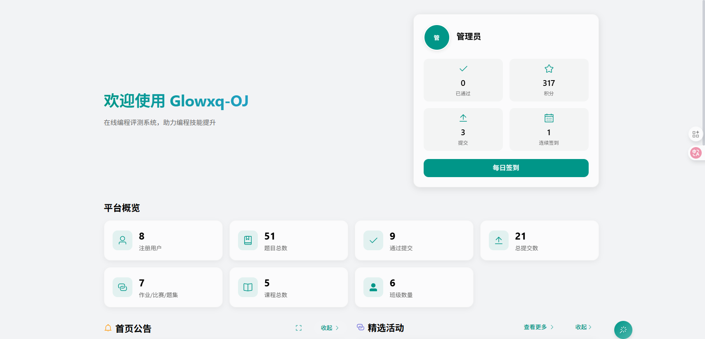
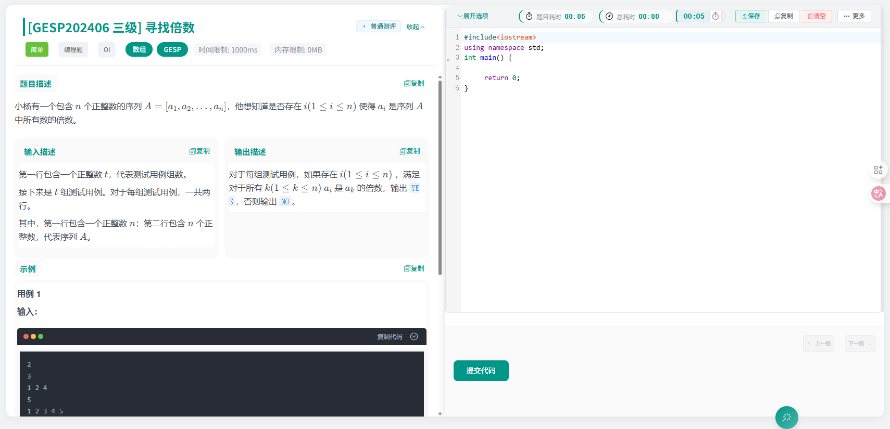

# Glowxq-OJ - 在线编程测评系统

<div align="center">


**面向信奥赛、少儿编程教学的在线测评平台**

[](LICENSE)
[](https://openjdk.java.net/projects/jdk/21/)
[](https://spring.io/projects/spring-boot)
[](https://vuejs.org/)
[](https://www.docker.com/)


[🚀 在线体验](http://42.192.87.184:7301/login) | [📖 完整文档](docs/) | [🐛 问题反馈](https://github.com/glowxq/glowxq-oj/issues)

</div>

## ✨ 项目简介

Glowxq-OJ 是一个专为信息学奥林匹克竞赛（信奥赛）和少儿编程教学设计的在线编程测评系统。本项目提供开源版本和商业版本，开源版本包含核心的在线测评功能，商业版本提供更完整的教学管理功能。

### 🎯 在线体验

- **商业版体验地址**: [http://42.192.87.184:7301](http://42.192.87.184:7301) (多租户版本记得**选择租户**)
- **开源版本**: 本仓库提供完整的开源实现，前后端已经整合，运行后访问http://localhost:7101访问

#### 🔑 默认测试账号

系统提供以下测试账号，密码统一为：**123456**

| 角色 | 账号 | 密码 | 说明 |
|------|------|------|------|
| 管理员 | 13667700000 | 123456 | 系统管理员，拥有所有权限 |
| 学生 | 13667700001 | 123456 | 普通学生账号，可提交代码 |
| 校长 | 13667700002 | 123456 | 校长账号，管理学校事务 |
| 老师 | 13667700003 | 123456 | 教师账号，管理班级和学生 |
| 系统管理员 | 13667700004 | 123456 | 超级管理员，系统维护 |

> 💡 **提示**: 生产环境请务必修改默认密码！

### 🌐 SaaS 云服务

**无需部署，开箱即用！** 我们提供专业的SaaS云服务，类似于 [Hydro](https://hydro.ac)、[洛谷](https://www.luogu.com.cn/) 等知名平台。

#### ✨ SaaS服务优势
- 🚀 **即开即用**: 无需复杂部署，注册账号即可使用
- 🎯 **完整功能**: 体验所有商业版功能，包括班级管理、多租户、GlowC、GlowGame等
- 🛠️ **技术支持**: 专业技术团队提供全方位支持
- 🔒 **数据安全**: 企业级数据安全保障
- 📈 **弹性扩容**: 根据使用量自动扩容，无需担心性能问题
- 💰 **成本优化**: 按需付费，相比自建节省70%以上成本

#### 📞 获取SaaS服务
想要体验完整的商业版功能？联系我们获取SaaS服务账号：
- **邮箱**: [glowxq@qq.com](mailto:glowxq@qq.com)
- **微信**: 扫描下方二维码添加作者微信

<div align="center">
<table>
<tr>
<td align="center">

<br/>
<b>联系客服微信</b>
</td>
<td align="center">

<br/>
<b>技术交流群</b>
</td>
</tr>
</table>
</div>

### 📋 版本对比

| 功能模块 | 开源版 | 商业版 |
|---------|--------|--------|
| 在线测评 | ✅ | ✅ |
| 题目管理 | ✅ | ✅ |
| 用户系统 | ✅ | ✅ |
| 代码编辑器 | ✅ | ✅ |
| 多语言支持 | ✅ | ✅ |
| 班级管理 | ❌ | ✅ |
| 多租户系统 | ❌ | ✅ |
| GlowC (C++画图) | ❌ | ✅ |
| GlowGame (编程游戏) | ❌ | ✅ |
| 部门管理 | ❌ | ✅ |
| 持续更新 | 社区驱动 | 商业支持 |

## 🏗️ 技术架构

### 后端技术栈
- **核心框架**: Spring Boot 3.x + Java 21
- **数据库**: MySQL 8.0 + Redis
- **ORM框架**: MyBatis-Flex
- **权限认证**: Sa-Token
- **API文档**: Knife4j (Swagger)
- **消息队列**: 内置队列系统
- **文件存储**: 本地存储 + OSS支持
- **容器化**: Docker + Docker Compose

### 前端技术栈
- **框架**: Vue 3.x + TypeScript
- **UI组件**: Element Plus
- **代码编辑器**: Monaco Editor
- **构建工具**: Vite
- **状态管理**: Pinia

### 判题系统
- **沙箱技术**: 安全沙箱
- **支持语言**: C/C++、Java、Python、JavaScript等
- **判题模式**: 普通判题、特殊判题、交互判题
- **性能优化**: 虚拟线程 + 异步处理

## 📚 文档导航

### 🚀 快速上手
- [📖 文档中心](docs/) - 完整的文档导航和索引
- [⚡ 快速部署](docs/deployment/quick-start.md) - 5分钟快速部署指南
- [🐳 Docker部署](docs/deployment/docker-deploy.md) - Docker一键部署方案

### 📖 详细文档
- [🛠️ 部署指南](docs/deployment/deployment-guide.md) - 完整的部署配置指南
- [💻 开发指南](docs/development/development-guide.md) - 开发环境搭建和规范
- [👤 用户指南](docs/user/user-guide.md) - 系统使用手册
- [🔧 管理指南](docs/admin/admin-guide.md) - 系统管理员操作指南

### 🎯 按角色查看
- **开发者**: [开发指南](docs/development/development-guide.md) → [API文档](docs/development/api-reference.md)
- **管理员**: [快速部署](docs/deployment/quick-start.md) → [管理指南](docs/admin/admin-guide.md)
- **教师**: [用户指南](docs/user/user-guide.md) → [功能介绍](docs/user/features.md)
- **学生**: [用户指南](docs/user/user-guide.md) → [常见问题](docs/user/faq.md)

## 🚀 快速开始

### 环境要求

- **Java**: JDK 21+
- **Node.js**: 16.x+
- **MySQL**: 8.0+
- **Redis**: 6.0+
- **Docker**: 20.x+ (可选)
- **Maven**: 3.8+

### 🐳 Docker 一键部署（推荐）

**全自动部署，包含MySQL、Redis、应用服务的完整解决方案！**

1. **克隆项目**
```bash
git clone https://github.com/glowxq/glowxq-oj.git
cd glowxq-oj
```

2. **一键启动**
```bash
# Linux/macOS
chmod +x start.sh
./start.sh

# Windows (使用Git Bash或WSL)
bash start.sh
```

3. **访问系统**
- 前端地址: http://localhost:7101
- API文档: http://localhost:7101/doc.html

**✨ 特性：**
- 🚀 一键部署，自动配置MySQL、Redis
- 📦 自动导入初始化SQL数据
- 🔄 服务健康检查和自动重启
- 💾 数据持久化存储
- 📊 完整的日志和监控

**🛠️ 管理命令：**
```bash
./start.sh          # 启动所有服务
./stop.sh           # 停止所有服务
./stop.sh --cleanup # 停止并清理资源
```

详细部署说明请参考：[Docker部署指南](docs/deployment/docker-deploy.md)

### 🛠️ 本地开发部署

#### 1. 数据库准备

**MySQL 配置**
```sql
-- 创建数据库
CREATE DATABASE glowxq_oj CHARACTER SET utf8mb4 COLLATE utf8mb4_general_ci;
CREATE DATABASE glowxq_system CHARACTER SET utf8mb4 COLLATE utf8mb4_general_ci;

-- 导入初始化数据
source init/初始化SQL.sql;
```

**Redis 配置**
```bash
# 启动 Redis 服务
redis-server
```

#### 2. 后端启动

```bash
# 安装依赖
mvn clean install -DskipTests

# 启动 OJ 服务
cd app/app-oj
mvn spring-boot:run

# 启动系统管理服务（可选）
cd app/app-system
mvn spring-boot:run
```

#### 3. 前端启动

前端已经集成到springboot中 springboot启动时会自动启动vue项目，所以不需要再启动前端项目。
直接访问 localhost:7101 即可访问前端页面。

## 📸 系统截图

### 🎨 特色功能 - C++画图 (GlowC)
<div align="center">


<table>
<tr>
<td align="center" width="50%">

<br/>
<b>GlowC代码编辑器</b>
</td>
<td align="center" width="50%">

<br/>
<b>GlowC图形输出</b>
</td>
</tr>
<tr>
<td align="center" colspan="2">

<br/>
<b>GlowC功能展示</b>
</td>
</tr>
</table>

</div>

### 📡 特色功能 - 代码监控推送
<div align="center">


<br/>
<b>代码监控推送界面</b>

</div>

### 🏠 系统主界面
<div align="center">
<table>
<tr>
<td align="center" width="50%">

<br/>
<b>系统主界面-首页</b>
</td>
<td align="center" width="50%">

<br/>
<b>系统主界面-暗黑模式</b>
</td>
</tr>
<tr>
<td align="center" colspan="2">

<br/>
<b>系统主界面-功能概览</b>
</td>
</tr>
</table>
</div>


### 📝 题目管理模块
<div align="center">
<table>
<tr>
<td align="center" width="50%">

<br/>
<b>题目列表</b>
</td>
<td align="center" width="50%">

<br/>
<b>题目详情</b>
</td>
</tr>
<tr>
<td align="center" width="50%">

<br/>
<b>题目编辑</b>
</td>
<td align="center" width="50%">

<br/>
<b>代码编辑器</b>
</td>
</tr>
<tr>
<td align="center" colspan="2">

<br/>
<b>题目提交界面</b>
</td>
</tr>
</table>
</div>

### 🏫 班级管理模块
<div align="center">
<table>
<tr>
<td align="center" width="50%">

<br/>
<b>班级管理</b>
</td>
<td align="center" width="50%">

<br/>
<b>学生管理</b>
</td>
</tr>
</table>
</div>

### 🏆 比赛与作业模块
<div align="center">
<table>
<tr>
<td align="center" width="50%">

<br/>
<b>比赛列表</b>
</td>
<td align="center" width="50%">

<br/>
<b>比赛详情</b>
</td>
</tr>
<tr>
<td align="center" width="50%">

<br/>
<b>作业管理</b>
</td>
<td align="center" width="50%">

<br/>
<b>排行榜</b>
</td>
</tr>
</table>
</div>

### ⚡ 测评结果模块
<div align="center">
<table>
<tr>
<td align="center" width="50%">

<br/>
<b>测评结果</b>
</td>
<td align="center" width="50%">

<br/>
<b>代码查看</b>
</td>
</tr>
</table>
</div>

### 👥 用户管理模块
<div align="center">
<table>
<tr>
<td align="center" width="50%">

<br/>
<b>用户列表</b>
</td>
<td align="center" width="50%">

<br/>
<b>用户详情</b>
</td>
</tr>
<tr>
<td align="center" colspan="2">

<br/>
<b>用户权限管理</b>
</td>
</tr>
</table>
</div>

### 🔐 权限管理模块
<div align="center">
<table>
<tr>
<td align="center" width="50%">

<br/>
<b>角色管理</b>
</td>
<td align="center" width="50%">

<br/>
<b>权限配置</b>
</td>
</tr>
</table>
</div>

### ⚙️ 系统管理模块
<div align="center">
<table>
<tr>
<td align="center" width="50%">

<br/>
<b>系统配置</b>
</td>
<td align="center" width="50%">

<br/>
<b>系统监控</b>
</td>
</tr>
</table>
</div>

## 🔧 配置说明

### 数据库配置
```yaml
# application.yml
spring:
  datasource:
    driver-class-name: com.mysql.cj.jdbc.Driver
    url: jdbc:mysql://localhost:3306/glowxq_oj?useUnicode=true&characterEncoding=UTF-8&serverTimezone=GMT%2B8
    username: root
    password: your_password
```

### Redis配置
```yaml
spring:
  redis:
    host: localhost
    port: 6379
    password: your_redis_password
    database: 0
```

## 🚀 部署指南

### 生产环境部署

#### 1. 服务器要求
- **CPU**: 2核心以上
- **内存**: 4GB以上
- **存储**: 100GB以上SSD
- **网络**: 5Mbps以上带宽

#### 2. Docker生产部署
```bash
# 1. 准备生产配置
cp init/docker-compose.yml docker-compose.prod.yml

# 2. 修改生产配置
vim docker-compose.prod.yml

# 3. 启动生产服务
docker-compose -f docker-compose.prod.yml up -d

# 4. 配置反向代理（Nginx）
# 参考 docs/nginx.conf
```

#### 3. 性能优化
```bash
# JVM参数优化
export JAVA_OPTS="-Xms2g -Xmx4g -XX:+UseG1GC"

# 数据库连接池优化
# 参考 docs/database-optimization.md
```

### 监控与维护
```bash
# 查看服务状态
docker-compose ps

# 查看日志
docker-compose logs -f glowxq-oj

# 备份数据
# 参考 docs/backup-guide.md
```

## 🛠️ 开发指南

### 开发环境搭建

#### 1. IDE配置
推荐使用 IntelliJ IDEA：
```bash
# 安装必要插件
- Lombok Plugin
- MyBatis Plugin
- Docker Plugin
```

#### 2. 代码规范
```bash
# 代码格式化
mvn spotless:apply

# 代码检查
mvn spotless:check
```

#### 3. 调试配置
```yaml
# application-dev.yml
logging:
  level:
    com.glowxq: DEBUG
    org.springframework.web: DEBUG
```

### 项目结构
```
glowxq-api/
├── app/                    # 应用启动模块
│   ├── app-oj/            # OJ服务启动类
│   └── app-system/        # 系统管理服务启动类
├── business/              # 业务逻辑模块
│   ├── business-oj/       # OJ业务逻辑
│   └── business-system/   # 系统管理业务逻辑
├── common/                # 公共模块
│   ├── common-core/       # 核心工具类
│   ├── common-db-mysql/   # MySQL配置
│   ├── common-db-redis/   # Redis配置
│   ├── common-security/   # 安全认证
│   └── ...
├── init/                  # 初始化文件
│   ├── docker-compose.yml # Docker配置
│   └── 初始化SQL.sql      # 数据库初始化
└── docs/                  # 文档目录
```

### API开发规范

#### 1. Controller层
```java
@Tag(name = "题目管理")
@RestController
@RequestMapping("/api/problem")
@RequiredArgsConstructor
public class ProblemController {

    @Operation(summary = "获取题目列表")
    @GetMapping("/list")
    public ApiResult<PageResult<Problem>> list(@Valid ProblemQueryDTO dto) {
        // 实现逻辑
    }
}
```

#### 2. Service层
```java
@Service
@RequiredArgsConstructor
public class ProblemServiceImpl implements ProblemService {

    @Override
    @Transactional(rollbackFor = Exception.class)
    public void create(ProblemCreateDTO dto) {
        // 实现逻辑
    }
}
```

### 测试指南

#### 1. 单元测试
```java
@SpringBootTest
class ProblemServiceTest {

    @Autowired
    private ProblemService problemService;

    @Test
    void testCreateProblem() {
        // 测试逻辑
    }
}
```

#### 2. 集成测试
```bash
# 运行所有测试
mvn test

# 运行特定测试
mvn test -Dtest=ProblemServiceTest
```

## 🤝 贡献指南

我们欢迎所有形式的贡献！

### 如何贡献

1. **Fork 项目**
2. **创建特性分支** (`git checkout -b feature/AmazingFeature`)
3. **提交更改** (`git commit -m 'Add some AmazingFeature'`)
4. **推送到分支** (`git push origin feature/AmazingFeature`)
5. **创建 Pull Request**

### 贡献类型
- 🐛 Bug修复
- ✨ 新功能开发
- 📝 文档改进
- 🎨 UI/UX优化
- ⚡ 性能优化
- 🧪 测试用例

### 代码规范
- 遵循阿里巴巴Java开发规范
- 使用Spotless进行代码格式化
- 编写完整的单元测试
- 添加必要的注释和文档

## 📚 常见问题

### Q: 如何添加新的编程语言支持？
A: 参考 `docs/language-support.md` 文档，需要配置语言编译器和运行环境。

### Q: 判题系统如何保证安全性？
A: 使用沙箱技术，限制程序的系统调用、文件访问和网络访问。

### Q: 如何自定义判题逻辑？
A: 可以编写特殊判题程序（SPJ），支持自定义的输出验证逻辑。

### Q: 系统支持多少并发用户？
A: 在标准配置下支持1000+并发用户，可通过集群部署进一步扩展。

## 🔄 更新日志

### v1.0.0 (2024-01-01)
- ✨ 初始版本发布
- 🎯 支持基础的在线测评功能
- 💻 支持C/C++、Java、Python等主流语言
- 🔐 完整的用户权限管理系统

### v1.1.0 (2024-02-01)
- ✨ 新增特殊判题支持
- 🚀 性能优化，支持更高并发
- 🐛 修复若干已知问题
- 📝 完善文档和示例

## 📄 许可证

本项目采用 [Apache License 2.0](LICENSE) 许可证。

## 🙏 致谢

感谢以下开源项目的支持：

### 🛠️ 技术框架
- [MyBatis-Flex](https://mybatis-flex.com/) - 优雅的MyBatis增强框架
- [Sa-Token](https://sa-token.cc/) - 轻量级Java权限认证框架

### 🏆 优秀的系统
- [sz-admin](https://szadmin.cn/) - 优秀的后台管理系统模板
- [HOJ](https://gitee.com/himitzh0730/hoj) - 基于SpringBoot+Vue的在线评测系统
- [Hydro](https://hydro.ac/) - 高效的在线评测平台


特别感谢这些优秀的开源OJ项目为我们提供的设计思路和技术参考，让我们能够站在巨人的肩膀上构建更好的系统。

## 📞 联系我们

- **项目主页**: [https://github.com/glowxq/glowxq-oj](https://github.com/glowxq/glowxq-oj)
- **问题反馈**: [Issues](https://github.com/glowxq/glowxq-oj/issues)
- **商业合作**: [联系我们](mailto:glowxq@qq.com)
- **技术交流群**: 加入我们的QQ群或微信群

---

<div align="center">

**如果这个项目对你有帮助，请给我们一个 ⭐ Star！**

Made with ❤️ by GlowXQ Team

</div>