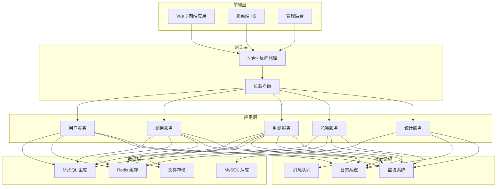

# 系统架构设计

## 🏗️ 整体架构

Glowxq-OJ 采用现代化的微服务架构设计，基于 Spring Boot 3.x 和 Java 21 构建，具有高性能、高可用、易扩展的特点。

## 📊 架构图



## 🎯 设计原则

### 1. 单一职责原则
每个服务模块只负责一个特定的业务领域：
- **用户服务**: 用户认证、权限管理、个人信息
- **题目服务**: 题目管理、测试数据、题目搜索
- **判题服务**: 代码编译、执行、结果评判
- **竞赛服务**: 竞赛管理、排行榜、参赛管理
- **统计服务**: 数据统计、报表生成、性能分析

### 2. 高内聚低耦合
- 模块内部功能高度相关
- 模块间通过明确的接口通信
- 减少模块间的直接依赖

### 3. 可扩展性
- 支持水平扩展
- 模块化设计便于功能扩展
- 插件化架构支持第三方扩展

## 🏢 分层架构

### 表现层 (Presentation Layer)
```
├── Controller          # REST API 控制器
├── WebSocket          # WebSocket 处理器
├── Filter             # 请求过滤器
└── Interceptor        # 请求拦截器
```

**职责**:
- 处理HTTP请求和响应
- 参数验证和转换
- 异常处理和错误响应
- WebSocket实时通信

### 业务层 (Business Layer)
```
├── Service            # 业务服务接口
├── ServiceImpl        # 业务服务实现
├── Manager            # 业务管理器
└── Strategy           # 策略模式实现
```

**职责**:
- 核心业务逻辑处理
- 事务管理
- 业务规则验证
- 服务编排

### 数据访问层 (Data Access Layer)
```
├── Mapper             # MyBatis 映射器
├── Entity             # 数据实体
├── DTO                # 数据传输对象
└── Repository         # 数据仓库
```

**职责**:
- 数据库操作
- 数据映射和转换
- 缓存管理
- 数据一致性保证

## 🔧 核心组件

### 1. 认证授权组件
```java
@Component
public class AuthenticationManager {
    // Sa-Token 集成
    // JWT Token 管理
    // 权限验证
    // 单点登录支持
}
```

**特性**:
- 基于 Sa-Token 的认证框架
- 支持多种认证方式（用户名密码、第三方登录）
- 细粒度权限控制
- 会话管理和超时控制

### 2. 判题引擎
```java
@Service
public class JudgeEngine {
    // 代码编译
    // 安全沙箱执行
    // 结果评判
    // 资源监控
}
```

**特性**:
- 多语言支持（C/C++、Java、Python等）
- 安全沙箱隔离
- 资源限制（时间、内存、CPU）
- 并发判题处理

### 3. 缓存管理
```java
@Component
public class CacheManager {
    // Redis 缓存
    // 本地缓存
    // 缓存策略
    // 缓存一致性
}
```

**缓存策略**:
- **L1缓存**: 本地内存缓存（Caffeine）
- **L2缓存**: Redis分布式缓存
- **缓存预热**: 系统启动时预加载热点数据
- **缓存更新**: 数据变更时自动更新缓存

### 4. 消息队列
```java
@Component
public class MessageQueue {
    // 异步任务处理
    // 事件驱动
    // 削峰填谷
    // 系统解耦
}
```

**应用场景**:
- 判题任务异步处理
- 邮件发送
- 数据统计计算
- 系统通知

## 💾 数据架构

### 数据库设计
```sql
-- 用户相关表
user_info          -- 用户基本信息
user_role          -- 用户角色
user_permission    -- 用户权限

-- 题目相关表
problem            -- 题目信息
problem_tag        -- 题目标签
test_case          -- 测试用例

-- 提交相关表
submit_record      -- 提交记录
judge_result       -- 判题结果

-- 竞赛相关表
contest            -- 竞赛信息
contest_problem    -- 竞赛题目
contest_rank       -- 竞赛排名
```

### 数据分片策略
- **水平分片**: 按用户ID分片提交记录
- **垂直分片**: 分离热点数据和冷数据
- **读写分离**: 主库写入，从库读取
- **数据归档**: 定期归档历史数据

## 🚀 性能优化

### 1. 数据库优化
```sql
-- 索引优化
CREATE INDEX idx_submit_user_time ON submit_record(user_id, submit_time);
CREATE INDEX idx_problem_difficulty ON problem(difficulty, status);

-- 查询优化
-- 分页查询优化
-- 连接查询优化
```

### 2. 缓存优化
```java
// 多级缓存
@Cacheable(value = "problem", key = "#id")
public Problem getProblemById(Long id) {
    return problemMapper.selectById(id);
}

// 缓存预热
@PostConstruct
public void warmUpCache() {
    // 预加载热点数据
}
```

### 3. 异步处理
```java
// 异步判题
@Async("judgeExecutor")
public CompletableFuture<JudgeResult> judgeAsync(SubmitRecord submit) {
    return CompletableFuture.completedFuture(judge(submit));
}
```

### 4. 虚拟线程
```java
// Java 21 虚拟线程
@Configuration
public class VirtualThreadConfig {
    @Bean
    public Executor virtualThreadExecutor() {
        return Executors.newVirtualThreadPerTaskExecutor();
    }
}
```

## 🔒 安全架构

### 1. 网络安全
- HTTPS 加密传输
- CORS 跨域控制
- 防火墙配置
- DDoS 防护

### 2. 应用安全
- SQL 注入防护
- XSS 攻击防护
- CSRF 攻击防护
- 输入验证和过滤

### 3. 数据安全
- 敏感数据加密存储
- 数据库访问控制
- 数据备份和恢复
- 审计日志记录

### 4. 判题安全
```java
// 安全沙箱
public class SecuritySandbox {
    // 系统调用限制
    // 文件访问控制
    // 网络访问禁用
    // 资源使用限制
}
```

## 📊 监控体系

### 1. 应用监控
```java
// Micrometer 指标收集
@Component
public class MetricsCollector {
    private final MeterRegistry meterRegistry;
    
    public void recordJudgeTime(Duration duration) {
        Timer.Sample sample = Timer.start(meterRegistry);
        sample.stop(Timer.builder("judge.time").register(meterRegistry));
    }
}
```

### 2. 系统监控
- CPU、内存、磁盘使用率
- 网络流量监控
- 数据库性能监控
- 缓存命中率监控

### 3. 业务监控
- 用户活跃度
- 题目提交量
- 判题成功率
- 系统响应时间

### 4. 日志管理
```java
// 结构化日志
@Slf4j
@Component
public class LogManager {
    public void logJudgeResult(String submitId, String result) {
        log.info("Judge completed: submitId={}, result={}", submitId, result);
    }
}
```

## 🔄 部署架构

### 1. 容器化部署
```yaml
# docker-compose.yml
version: '3.8'
services:
  app:
    image: glowxq-oj:latest
    ports:
      - "7101:7101"
    environment:
      - SPRING_PROFILES_ACTIVE=prod
    depends_on:
      - mysql
      - redis
```

### 2. 集群部署
```yaml
# Kubernetes 部署
apiVersion: apps/v1
kind: Deployment
metadata:
  name: glowxq-oj
spec:
  replicas: 3
  selector:
    matchLabels:
      app: glowxq-oj
  template:
    spec:
      containers:
      - name: app
        image: glowxq-oj:latest
        ports:
        - containerPort: 7101
```

### 3. 负载均衡
```nginx
# Nginx 配置
upstream glowxq_backend {
    server app1:7101 weight=1;
    server app2:7101 weight=1;
    server app3:7101 weight=1;
}

server {
    listen 80;
    location / {
        proxy_pass http://glowxq_backend;
    }
}
```

## 🔮 未来规划

### 1. 微服务拆分
- 用户服务独立部署
- 判题服务集群化
- 数据服务分离

### 2. 云原生改造
- Kubernetes 原生支持
- 服务网格集成
- 自动扩缩容

### 3. 智能化功能
- AI 辅助判题
- 智能题目推荐
- 代码质量分析

---

**架构版本**: v1.0  
**更新时间**: 2025-08-27  
**架构师**: GlowXQ Team
